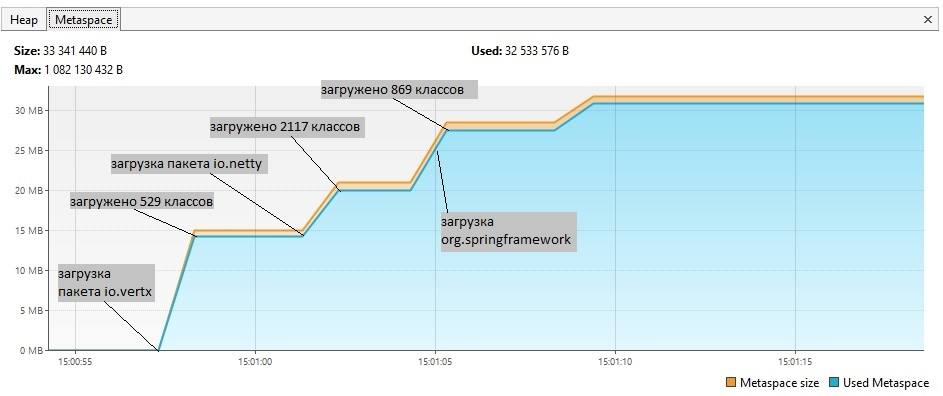
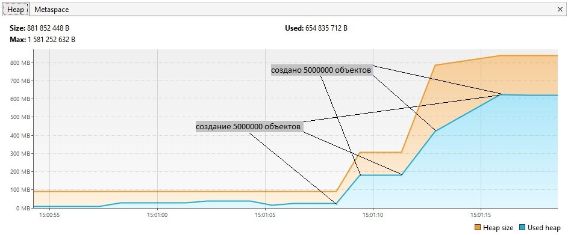
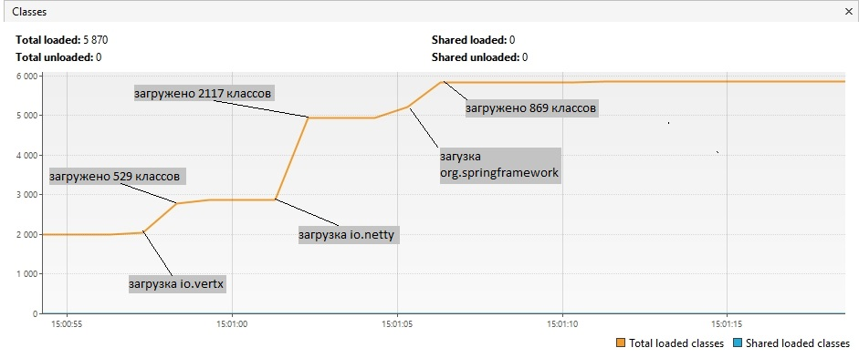

# Задача "Исследование JVM через VisualVM"

## Описание
Через 30с. после старта программы, три раза вызывается метод loadToMetaspaceAllFrom(), при этом в Metaspace загружаются классы из io.vertx, io.netty, org.springframework. Метод Thread.sleep() делает паузы по 3с. в промежутках (рис.1).
Далее создаются 3 объекта методом createSimpleObjects(), в количестве 5_000_000 каждый (рис2).
Сборка мусора в куче не видна.

рис.1 

рис.2 

рис.3 
